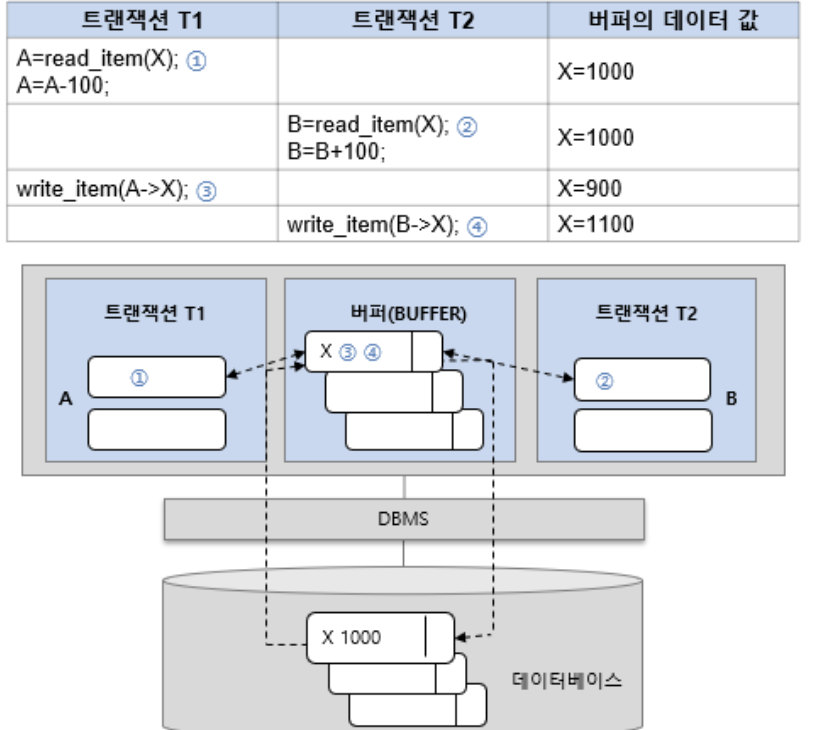
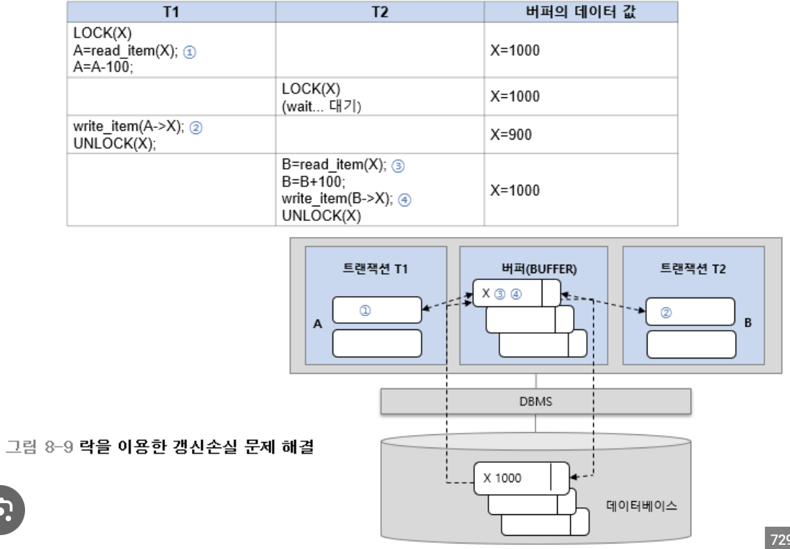
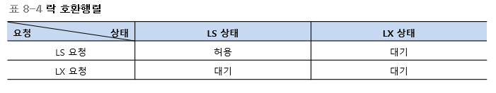
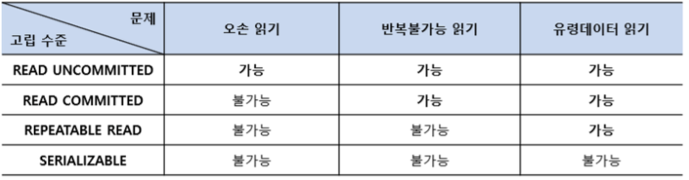

# CHAPTHER 08 트랜잭션, 동시성 제어, 회복

## 트랜잭션

**************************트랜잭션**************************

- DBMS가 데이터베이스를 다룰 때 사용하는 작업(프로그램) 단위이다.
- 원자성, 일관성, 고립성, 지속성의 성질을 가진다.

**********************트랜잭션**********************

- DBMS에서 데이터를 다루는 논리적인 작업의 단위
- 전체가 수행되거나 또는 전혀 수행되지 않아야 한다.

**데이터베이스에서 트랜잭션을 정의하는 이유**

- 데이터베이스에서 데이터를 다룰 때 장애가 일어나는 경우가 있다. 트랜잭션은 자애 발생시 데이터를 복구하는 작업의 단위가 된다.
- 데이터베이스에서 여러 작업이 동시에 같은 데이터를 다룰 때가 있다. 트랜잭션은 이 작업을 서로 분리하는 단위가 된다.

**DBMS에서 1번과 2번의 SQL 문이 하나의 수행 단위라는 것을 알리기 위해 사용되는 문법**

```sql
START TRANSACTION // 시작
	1 SQL 문
	2 SQL 문
COMMIT // 트랜잭션의 종료를 알리는 SQL 문
```

위와 같이 작성하면 두 SQL 문은 하나의 논리적인 작업의 단위가 된다.

트랜잭션은 데이터베이스에 저장된 테이블을 읽어와 주기억장치 버퍼에 저장하고, 버퍼에 저장된 데이터를 수정한 후 최종적으로 데이터베이스에 다시 저장한다.

**변경된 테이블 값을 주기억장치 버퍼에서 하드디스크에 기록하는 과정은 DBMS가 책임지고 수행한다.**

- DBMS가 동시에 많은 트랜잭션을 수행할 때, 각각의 트랜잭션이 하드디스크에 개별 접근하는 것을 피하고 DBMS가 일괄적으로 하드디스크에 접근하여 처리함으로써 사용자에게 빠른 응답성을 보장하기 위해서이다. ex) 수강신청

**트랜잭션의 수행 과정**

- 시작 → 수행 → 부분완료 → 버퍼 내용 기록 → 완료

******************************************트랜잭션의 성질******************************************

- 원자성 ( automicity ) : 트랜잭션에 포함된 작업은 전부 수행되거나 아니면 전부 수행되지 않아야 한다.
- 일관성 ( Consistency ) : 트랜잭션을 수행하기 전이나 수행한 후나 데이터 베이스는 항상 일관된 상태를 유지해야 한다.
- 고립성 ( Isolation ) : 수행 중인 트랜잭션에 다른 트랜잭션이 끼어들어 변경 중인 데이터 값을 훼손하는 일이 없어야 한다.
- 지속성 ( Durabbility ) : 수행을 성공적으로 완료한 트랜잭션은 변경한 데이터를 영구히 저장해야한다. 저장된 데이터베이스는 저장 직후 혹은 어느 때나 발생할 수 있는 정전, 장애, 오류에 영향을 받지 않아야 한다.
    - 부분완료 : 트랜잭션 수행은 완료되었지만 변경 내용이 데이터베이스에 기록되었는지 확실하지 않는 상태
    - 실패 : 트랜잭션을 중간에 중단하였거나 부분완료 상태에서 변경 내용을 데이터베이스에 저장하지 못한 상태

****************************************************트랜잭션 제어 명령어****************************************************

| 표준 명령어 | 문법 | 설명 |
| --- | --- | --- |
| START TRANSACTION | SET TRANSACTION | 트랜잭션의 시작 |
| COMMIT | COMMIT | 트랜잭션의 종료 |
| ROLLBACK | ROLLBACK {TO <savepoint> } | 트랜잭션을 전체 혹은 savepoint까지 무효화시킴 |
| SAVE | SAVEPOINT <identifier> | save point를 만듦 |

**SAVEPOINT**

- 트랜잭션의 길이가 길면 트랜잭션의 중간 지점에 수정 내용을 반영하는 포인트 만드는데 이를 SAVEPOINT라 한다.
- 트랜잭션 안에 여러 개를 만들 수 있다.

## 동시성 제어

**동시성 제어**

- 트랜잭션이 동시에 수행될 때, 일관성을 해치지 않도록 트랜잭션의 데이터 접근을 제어하는 DBMS의 기능

**갱신손실 문제**

- 갱신손실 문제는 두 개의 트랜잭션이 한 개의 데이터를 동시에 갱신할 때 발생한다.



**락**

갱신손실 문제를 해결하려면 상대방 트랜잭션이 데이터를 사용하는지 여부를 알 수 있는 규칙이 필요하다. 즉, 자신이 데이터를 수정 중이라는 사실을 알리면 된다. 알리는 방법으로 락이라는 잠금장치를 사용한다.

- 트랜잭션이 데이터를 읽거나 수정할 때 데이터에 표시하는 잠금 장치
- 락을 이용하여 자신이 사용할 데이터를 잠그면 다른 트랜잭션은 잠금이 풀릴 때까지 기다려야 한다.
- 락을 사용하면 데이터에 대한 갱신을 순차적으로 진행할 수 있기 때문에 갱신손실 문제를 해결할 수 있다.



**********************락의 유형**********************

- 트랜잭션이 다르는 데이터는 읽기만 하는 데이터, 읽고 쓰는 데이터, 쓰기만 하는 데이터가 있다. 이 중에서 읽기만 하나는 데이터를 다루는 트랙잭션은 어느 정도 허용을 해도 문제가 없다. 이 점을 고려하여 락의 유형을 두 가지로 나눈다.
- 공유락 : 데이터 읽기를 표시하는 락 / 배타락 : 데이터 쓰기를 표시하는 락

**데이터 X를 다르는 트랙잭션이 공유락과 베타락을 사용하는 규칙**

- 데이터에 락이 걸려있지 않으면 트랜잭션은 데이터에 락을 걸 수 있다.
- 트랜잭션이 데이터 X를 읽기만 할 경우 LS(X)
- 데이터에 락이 걸려있지 않으면 트랜잭션은 데이터에 락을 걸 수 있다.
- 트랜잭션이 데이터 X를 읽기만 할 경우 LS(X)를 요청하고, 읽거나 쓰기를 할 경우 LX(X)를 요청한다.
- 다른 트랜잭션이 데이터에 LS(X)를 걸어둔 경우, LS(X)의 요청은 허용하고 LX(X)는 허용하지 않는다.
- 다른 트랜잭션이 데이터에 LX(X)를 걸어둔 경우, LS(X)와 LX(X) 모두 허용하지 않는다.
- 트랜잭션이 락을 허용받지 못하면 대기 상태가 된다.



**************************2단계 락킹**************************

- 락을 사용하면 갱신손실 문제를 해결할 수 있다.
- 락을 걸고 해제하는 시점에 제한을 두지 않으면 두 개의 트랜잭션이 동시에 실행될 때 데이터의 일관성이 깨질 수 있다. 즉, 데이터에 락을 걸었다 풀고 다시 거는 중간 과정에 락의 해지 상태가 생기면서 다른 트랜잭션에게 중간 결과를 보일 수 있다는 것 → 이를 방지 하기 위해 2단계 락킹 기법 사용
- 확장 단계 : 트랜잭션이 필요한 락을 획득하는 단계로, 이 단계에서는 이미 획득한 락을 해제하지 않는다.
수축 단계 : 트랜잭션이 락을 해제하는 단계로, 이 단계에서는 새로운 락을 획득하지 않는다.

********************데드락********************

- 두 개 이상의 트랜잭션이 각각 자신의 데이터에 대하여 락을 획득하고 상대방 데이터에 대하여 락을 요청하면 무한 대기 상태에 빠질 수 있다 → 이러한 현상을 데드락이라 함

## 트랜잭션 고립 수준

**오손 읽기**

- 읽기 작업을 하는 트랜잭션 1이 쓰기 작업을 하는 트랜잭션 2가 작업한 중간 데이터를 읽기 때문에 생기는 문제

************************************유령데이터 읽기************************************

- 트랜잭션 1이 데이터를 읽고 트랜잭션 2가 데이터를 쓰고 ( 삽입, INSERT ), 트랜잭션 1이 다시 한 번 데이터를 읽을 때 생기는 문제

********************************************************************트랜잭션 고립 수준 명령어********************************************************************

- 앞의 세 가지 문제를 해결하려면 락을 사용해야함.
- 하지만, DBMS는 트랙잭션을 동시에 실행시키면서 락보다 좀 더 완화된 방법으로 문제를 해결하는 명령어를 제공 → 트랜잭션 고립 수준 명령어 ( transaction isolation level instruction )



1. **READ UNCOMMITTED**
    - 고립 수준이 Level 0인 가장 낮은 명령어로, 자신의 데이터에 아무런 공유락도 걸지 않는다.
    - 사용자가 A라는 데이터를 B라는 데이터로 변경하는 동안 다른 사용자는 아직 완료되지 않은 데이터(오손 데이터) B를 읽을 수 있다.
2. **READ COMMITTED**
    - 고립 수준이 Level 1인 명령어로, 오손 페이지의 참조를 피하기 위해 자신의 데이터를 읽는 동안 공유락을 걸지만 트랜잭션이 끝나기 전에라도 해지 가능하다.
    - 사용자가 A라는 데이터를 B라는 데이터로 변경하는 동안 다른 사용자는 해당 데이터에 접근할 수 없다.
3. **REPEATABLE READ**
    - 고립 수준이 Level 2인 명령어로, 자신의 데이터에 설정된 공유락과 배타락을 트랜잭션이 종료될 때까지 유지하여 다른 트랜잭션이 자신의 데이터를 갱신(Update)할 수 없도록 한다.
    - 트랜잭션이 완료될 때까지 SELECT문이 사용하는 모든 데이터에 공유락이 걸리므로 다른 사용자는 그 영역에 해당되는 데이터에 대한 수정이 불가능하다. 하지만, 해당 영역을 제외한 나머지 범위에 대한 Insert는 가능하다.
4. **SERIALIZABLE**
    - 고립 수준이 Level3인 가장 높은 명령어로, 실행 중인 트랜잭션은 다른 트랜잭션으로부터 완벽하게 분리한다.

## 회복

******회복******

- 데이터베이스에 장애가 발생했을 때 데이터베이스를 일관성 있는 상태로 되돌리는 DBMS의 기능

**데이터베이스 시스템에서 발생할 수 있는 장애의 유형**

- **시스템충돌**: 하드웨어 혹은 소프트웨어의 오류로 인하여 주기억장치가 손실되는 것을 말한다. 주기억장치에 상주하여 처리 중인 프로그램과 데이터의 일부 혹은 전부가 손실된다.
- **미디어 장애**: 헤드의 충돌이나 읽기 장애에 의하여 보조기억장치의 일부 데이터가 손실되는 것을 말한다. 보조기억장치에 저장 중인 데이터의 일부 혹은 전부가 손실된다.
- **응용 소프트웨어 오류**: 데이터베이스에 접근하는 소프트웨어의 논리적인 오류로 트랜잭션의 수행이 실패하는 것을 말한다.
- **자연재해**: 화재, 홍수, 지진, 정전 등에 의해 컴퓨터 시스템이 손상되는 것을 말한다.
- **부주의 혹은 태업(sabotage)**: 운영자나 사용자의 부주의로 데이터가 손실되거나 의도적인 손상을 입는 것을 말한다.

********************************************트랜잭션과 회복********************************************

- 트랜잭션은 데이터베이스 회복의 단위
- 트랜잭션은 데이터의 변경 내용(버퍼)을 로그(임시 디스크)에 기록한 후 데이터 베이스에 반영한다.
- DBMS의 회복 관리자는 트랜잭션의 ACID 성질 중 원자성과 지속성을 보장하여 장애로부터 데이터베이스를 보호한다.

******************로그 파일******************

- 트랜잭션이 반영한 모든 데이터의 변경사항을 데이터베이스에 기록하기 전에 미리 기록해두는 별도의 데이터베이스
- ‘로그의 타입’은 트랜잭션의 연산 타입으로 START, INSERT, UPDATE, DELETE, ABORT, COMMIT 등이 있다.

************************로그 파일을 이용한 회복************************

- 트랜잭션의 재실행(REDO)
    - 장애가 발생한 후 시스템을 다시 가동 했을 때, 로그 파일에 트랜잭션의 시작과 종료가 있는 경우
    - 로그를 보면서 트랜잭션이 변경한 내용을 데이터베이스에 다시 기록하는 과정
- 트랜잭션의 취소(UNDO)
    - 장애가 발생한 후 시스템을 다시 가동했을 때, 로그 파일에 트랜잭션의 시작만 있고 종료가 없는 경우
    - 로그를 보면서 트랜잭션이 변경한 내용을 데이터베이스에서 원상복구시키는 과정
- 즉시갱신
    - ‘버퍼 → 로그 파일’, ‘버퍼 → 데이터베이스’ 작업이 부분 완료 전에 동시에 진행될 수 있으며, 부분 완료 전에 버퍼의 갱신 데이터는 로그에 기록이 진행이 된 상태이며 부분완료 전에 버퍼의 일부 내용이 실제 데이터베이스에 반영이 될 수 있다.
- 지연갱신
    - ‘버퍼 → 로그 파일’이 모두 끝난 후 부분완료를 하고 이후 ‘버퍼 → 데이터베이스’ 작업을 진행하는 방법
    - 부분완료 전에는 갱신 내용이 실제 데이터베이스에 반영되지 않는 상태

**********************************************************************체크포인트를 이용한 회복**********************************************************************

**체크포인트** : 회복 시 많은 양의 로그를 검색하고 갱신하는 시간을 줄이기 위하여 몇 십 분 단위로 데이터베이스와 트랜잭션 로그 파일을 동기화한 후 동기화한 시점을 로그 파일에 기록해두는 방법

체크포인트 시점에는 다음과 같은 작업을 진행한다.

- 주기억장치의 로그 레코드를 모두 하드디스크의 로그 파일에 저장한다.
- 버퍼에 있는 변경된 내용을 하드디스크의 데이터베이스에 저장한다.
- 체크포인트를 로그 파일에 표시한다.

****************************************************************************************************************트랜잭션의 로그 기록에 따라 회복하는 방법****************************************************************************************************************

- 체크포인트 이전에 COMMIT 기록이 있는 경우(즉시,지연갱신)
    - 아무 작업이 필요 없다.
    - 로그에 체크포인트가 나타나는 시점은 이미 변경 내용이 체크포인트에 의하여 모두 기록된 후이기 때문이다.
- 체크포인트 이후에 COMMIT 기록이 있는 경우(즉시, 지연갱신)
    - REDO(T)를 진행한다.
    - 체크포인트 이후에 변경 내용이 데이터베이스에 반영되지 않았을 가능성이 있으므로 REDO를 진행한다.
- 체크포인트 이후에 COMMIT 기록이 없는 경우
    - 즉시 갱신 방법을 사용했다면 UNDO(T)를 진행한다.
    - 버퍼의 내용이 반영됐을 수도 있기 때문에 원상복구 시켜야 함.
    - 지연 갱신 방법을 사용했다면 아무것도 할 필요가 없다.
    - 지연 갱신 방법은 COMMIT 이전에는 버퍼의 내용을 데이터베이스에 반영하지 않기 때문이다.